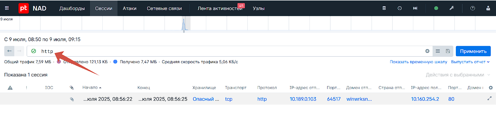
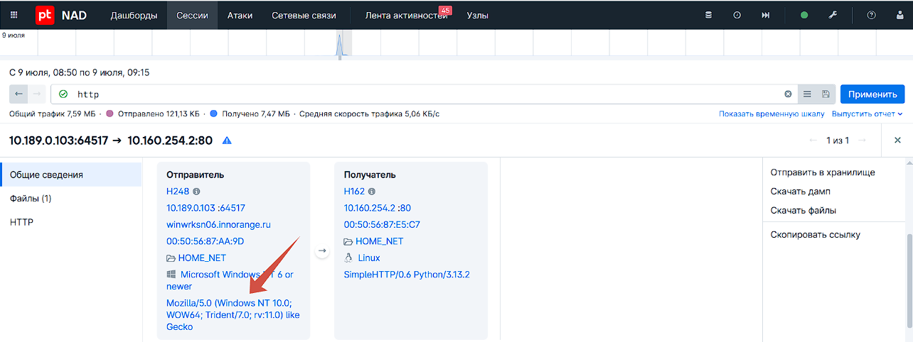
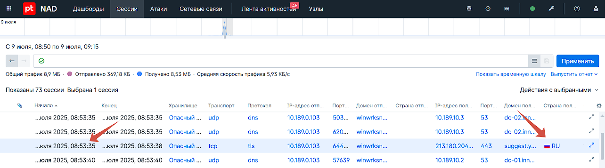
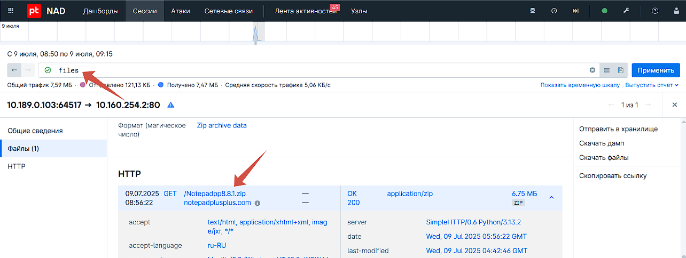

# 1. Выставляем временные рамки инцидента в СЗИ

### Какой браузер использовал Петр Иванов на хосте?

2. В PT NAD пишем фильтр:

```
http
```



Всего одна сессия по протоколу http, в которой мы находим следующую информацию:



User-Agent — это строка, которую браузер или другое клиентское приложение отправляет веб-серверу при каждом запросе. 
Её главная цель — сообщить серверу о характере клиента, который делает запрос. Это помогает серверу предоставлять контент, оптимально подходящий для данного устройства и браузера.

Trident/7.0 - это название движка обработки кода (rendering engine), который использовался в браузере Internet Explorer. Версия 7.0 — это движок от IE 11.

### Ответ: Internet Explorer

### Какой российский сайт посетил Петр Иванов в 8:53?

3. Добавляем столбец с информацией о получателе, и узнаем, что в 8:53 был открыт только один RU сайт



### Ответ: yandex.ru

### Укажите полный URL, по которому был скачан архив с программой

3. Пишем фильтр:

```
files
```

Появляется всего одна сессия с установкой архива, оттуда берем ссылку



### Ответ: http://notepadplusplus.com/Notepadpp8.8.1.zip

### Укажите SHA256 хеш скачанного файла

### Ответ: 65c7382db52346e13ebaf5953f120ca6962894f4288471e3822d1e5001692089

### Какую версию Python использовал злоумышленник у себя на сервере?

### Ответ: 3.13.2

### Какое название было у файла-установщика скачанной программы?

### Ответ: npp.8.8.1.Installer.x64.exe

### Какой исполняемый файл был запущен установщиком из нестандартной директории?

### Ответ: regsvr32.exe

### Какую библиотеку пытался загрузить файл из предыдущего вопроса?

### Ответ: NppShell.dll

### Какое название правила корреляции в SIEM, которое сработало при подключении к серверу злоумышленника?

### Ответ: Suspicious_Connection

### Какой порт использовал злоумышленник для приема соединений?

### Ответ: 4849

### Укажите количество пакетов, полученных за время сессии Meterpreter

### Ответ: 1059

### Для повышения привилегий в системе злоумышленник создал в системе новую службу. Укажите ее название

### Ответ: riikhb

### Злоумышленник удалил важный для коллег Петра Иванова файл. Что это за файл?

### Ответ: расчет премии.xlsx
