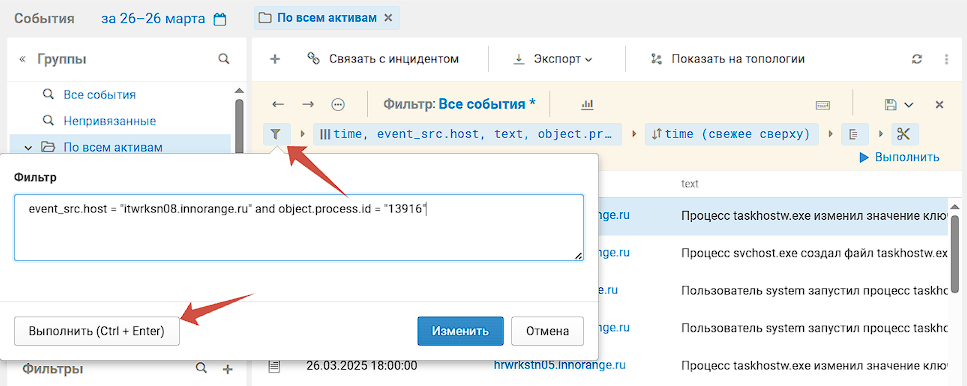
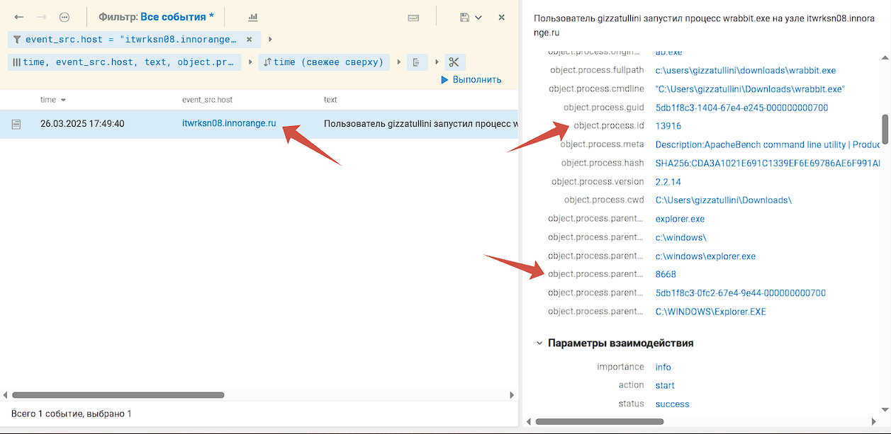
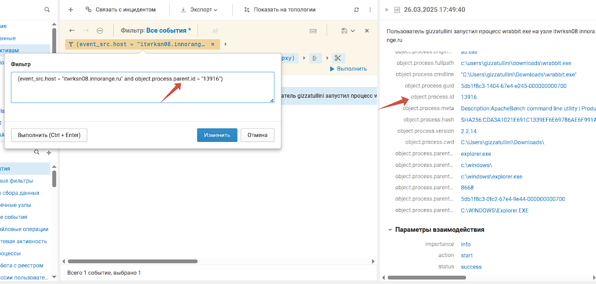

### Переходим в PT MP SIEM и выставляем время инцидента согласно заданию


### Далее необходимо выставить фильтр также исходя из задания (хост и id процесса)

```
event_src.host = "itwrksn08.innorange.ru" and object.process.id = "13916"
```



### После этого мы видим только 1 событие с запуском процесса, родительским процессом для него является explorer.exe



### Далее нам необходимо узнать для какого процесса этот является родительским (какой процесс он вызвал)

```
event_src.host = "itwrksn08.innorange.ru" and object.process.parent.id = "13916"
```




