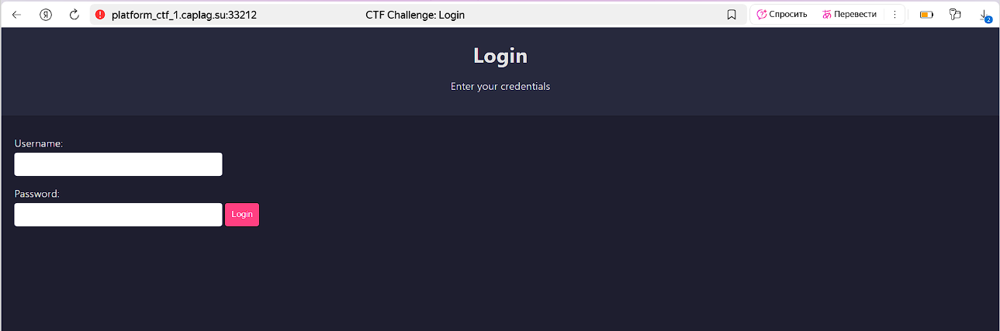
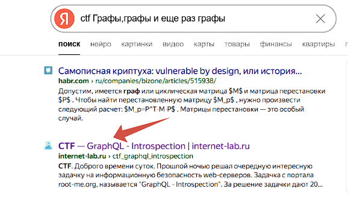

### Уязвимый сайт:

http://platform_ctf_1.caplag.su:33212



### Попробуем пофазить:

```
ffuf -w /usr/share/wordlists/dirb/big.txt \
-u "http://platform_ctf_1.caplag.su:33212/FUZZ" \
-t 50 \
-mc all \
-fc 400,404 \
-recursion \
-recursion-depth 10
```

Единственное, что мы нашли - это страницу /flag , но доступа к ней у нас очевидно нет.

### Задание намекает нам на "Графы"

Загуглим название задания в поиске подсказки:



### Далее еще один запрос в гугл и найдем эндпоинт:

http://platform_ctf_1.caplag.su:33212/graphql

Запросим схему:

query {
  __schema {
    types {
      name
      fields {
        name
        type {
          name
        }
      }
    }
  }
}

Результат:

{
  "data": {
    "__schema": {
      "types": [
        {
          "name": "JSON",
          "fields": null
        },
        {
          "name": "UserStats",
          "fields": [
            {
              "name": "_id",
              "type": {
                "name": "ID"
              }
            },
            {
              "name": "count",
              "type": {
                "name": "Int"
              }
            }
          ]
        },
        {
          "name": "ID",
          "fields": null
        },
        {
          "name": "Int",
          "fields": null
        },
        {
          "name": "Query",
          "fields": [
            {
              "name": "getUserStats",
              "type": {
                "name": null
              }
            }
          ]
        },
        {
          "name": "Boolean",
          "fields": null
        },
        {
          "name": "String",
          "fields": null
        },
        {
          "name": "__Schema",
          "fields": [
            {
              "name": "description",
              "type": {
                "name": "String"
              }
            },
            {
              "name": "types",
              "type": {
                "name": null
              }
            },
            {
              "name": "queryType",
              "type": {
                "name": null
              }
            },
            {
              "name": "mutationType",
              "type": {
                "name": "__Type"
              }
            },
            {
              "name": "subscriptionType",
              "type": {
                "name": "__Type"
              }
            },
            {
              "name": "directives",
              "type": {
                "name": null
              }
            }
          ]
        },
        {
          "name": "__Type",
          "fields": [
            {
              "name": "kind",
              "type": {
                "name": null
              }
            },
            {
              "name": "name",
              "type": {
                "name": "String"
              }
            },
            {
              "name": "description",
              "type": {
                "name": "String"
              }
            },
            {
              "name": "specifiedByUrl",
              "type": {
                "name": "String"
              }
            },
            {
              "name": "fields",
              "type": {
                "name": null
              }
            },
            {
              "name": "interfaces",
              "type": {
                "name": null
              }
            },
            {
              "name": "possibleTypes",
              "type": {
                "name": null
              }
            },
            {
              "name": "enumValues",
              "type": {
                "name": null
              }
            },
            {
              "name": "inputFields",
              "type": {
                "name": null
              }
            },
            {
              "name": "ofType",
              "type": {
                "name": "__Type"
              }
            }
          ]
        },
        {
          "name": "__TypeKind",
          "fields": null
        },
        {
          "name": "__Field",
          "fields": [
            {
              "name": "name",
              "type": {
                "name": null
              }
            },
            {
              "name": "description",
              "type": {
                "name": "String"
              }
            },
            {
              "name": "args",
              "type": {
                "name": null
              }
            },
            {
              "name": "type",
              "type": {
                "name": null
              }
            },
            {
              "name": "isDeprecated",
              "type": {
                "name": null
              }
            },
            {
              "name": "deprecationReason",
              "type": {
                "name": "String"
              }
            }
          ]
        },
        {
          "name": "__InputValue",
          "fields": [
            {
              "name": "name",
              "type": {
                "name": null
              }
            },
            {
              "name": "description",
              "type": {
                "name": "String"
              }
            },
            {
              "name": "type",
              "type": {
                "name": null
              }
            },
            {
              "name": "defaultValue",
              "type": {
                "name": "String"
              }
            },
            {
              "name": "isDeprecated",
              "type": {
                "name": null
              }
            },
            {
              "name": "deprecationReason",
              "type": {
                "name": "String"
              }
            }
          ]
        },
        {
          "name": "__EnumValue",
          "fields": [
            {
              "name": "name",
              "type": {
                "name": null
              }
            },
            {
              "name": "description",
              "type": {
                "name": "String"
              }
            },
            {
              "name": "isDeprecated",
              "type": {
                "name": null
              }
            },
            {
              "name": "deprecationReason",
              "type": {
                "name": "String"
              }
            }
          ]
        },
        {
          "name": "__Directive",
          "fields": [
            {
              "name": "name",
              "type": {
                "name": null
              }
            },
            {
              "name": "description",
              "type": {
                "name": "String"
              }
            },
            {
              "name": "isRepeatable",
              "type": {
                "name": null
              }
            },
            {
              "name": "locations",
              "type": {
                "name": null
              }
            },
            {
              "name": "args",
              "type": {
                "name": null
              }
            }
          ]
        },
        {
          "name": "__DirectiveLocation",
          "fields": null
        }
      ]
    }
  }
}


Скорее всего, сервер использует MongoDB.
Судя по:
1) _id вместо id,
2) Отсутствию SQL-специфичных фильтров,
3) Наличию типа JSON,
4) Простой структуре запросов,

Перехватываем запрос POST к /login:
(screen3)

В задании есть намек, нам нужно найти пароль который начинается с "admin"


NoSQL-инъекция работает, только если сервер принимает JSON и передаёт его "как есть" в БД. 
Поэтому меняем

Content-Type: application/x-www-form-urlencoded

на

Content-Type: application/json

А также добавляем регулярку с помощью которой найдем пароль который начинается с "admin"

(screen4)

Отправляем запрос и получаем перенаправление на эндпоинт flag, который был найден ранее:

(screen5)

Отправляем этот запрос с полученными куками:

(screen6)

